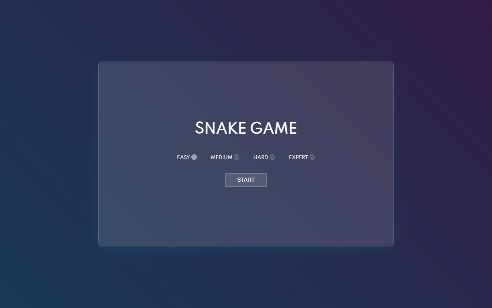
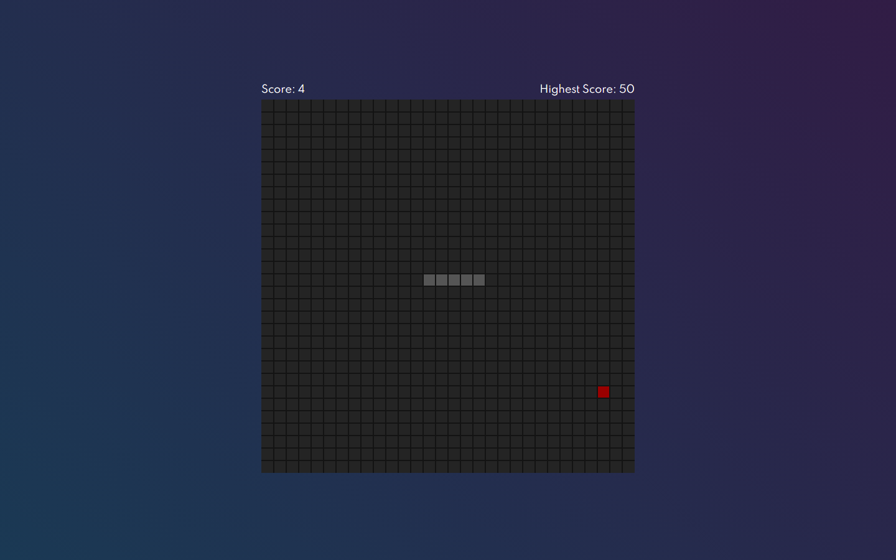
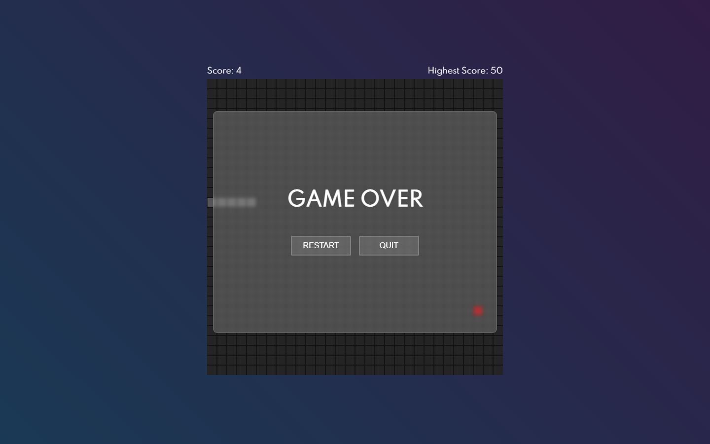

# 🐍 Snake Game 🐍 
*A simple and fun snake game made with javascript!*

The game has <strong>4 levels</strong> of difficulty (easy, medium, hard and expert) and you can <a href="https://gfrasson.github.io/snake-game/" target="_blank">play here!</a>

It has a friendly <strong>main screen</strong> where you can choose the difficulty to play!

The game itself is composed by a square <strong>board</strong> with different sizes depending on the difficulty from 10x10 (easy) to 30x30 (expert).

You can play as long as the snake doesn't hit its own body or the walls! If the snake dies, a <strong>game over</strong> screen appears so you can restart the game!

